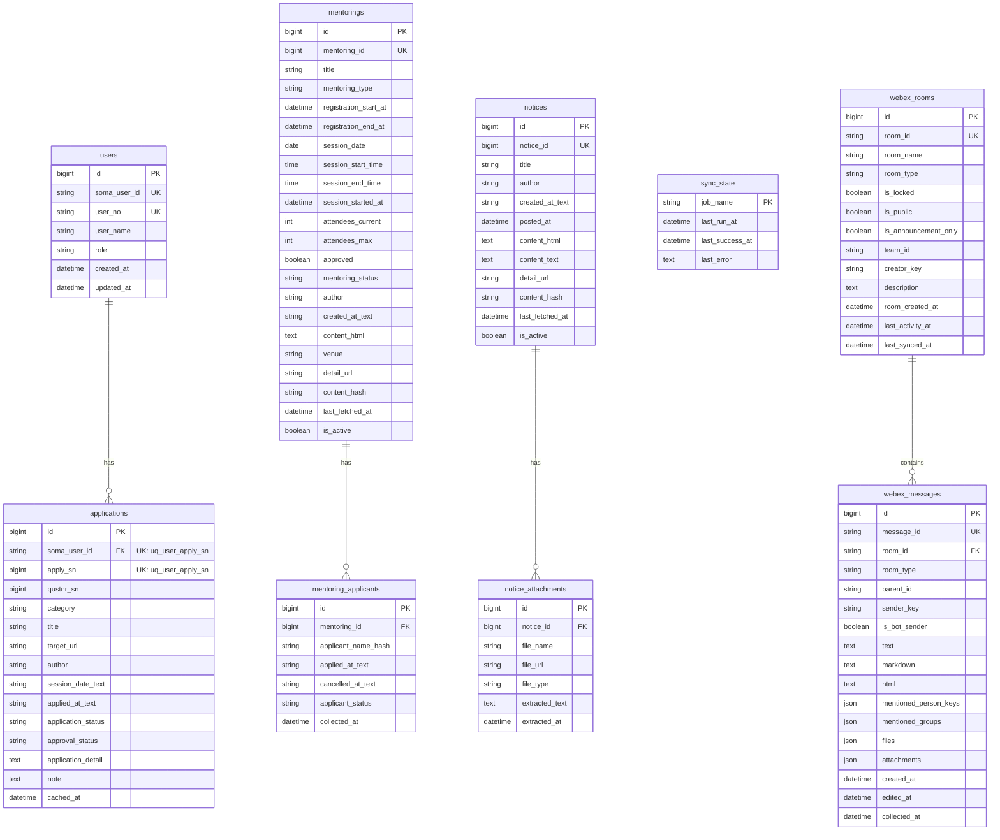

# Soma Agent

## Database Entity-Relationship Diagram (ERD)

```mermaid
erDiagram
    users {
        bigint id PK
        string soma_user_id UK
        string user_no UK
        string user_name
        string role
        datetime created_at
        datetime updated_at
    }

    applications {
        bigint id PK
        string soma_user_id FK "UK: uq_user_apply_sn"
        bigint apply_sn "UK: uq_user_apply_sn"
        bigint qustnr_sn
        string category
        string title
        string target_url
        string author
        string session_date_text
        string applied_at_text
        string application_status
        string approval_status
        text application_detail
        text note
        datetime cached_at
    }

    mentorings {
        bigint id PK
        bigint mentoring_id UK
        string title
        string mentoring_type
        datetime registration_start_at
        datetime registration_end_at
        date session_date
        time session_start_time
        time session_end_time
        datetime session_started_at
        int attendees_current
        int attendees_max
        boolean approved
        string mentoring_status
        string author
        string created_at_text
        text content_html
        string venue
        string detail_url
        string content_hash
        datetime last_fetched_at
        boolean is_active
    }

    mentoring_applicants {
        bigint id PK
        bigint mentoring_id FK
        string applicant_name_hash
        string applied_at_text
        string cancelled_at_text
        string applicant_status
        datetime collected_at
    }

    notices {
        bigint id PK
        bigint notice_id UK
        string title
        string author
        string created_at_text
        datetime posted_at
        text content_html
        text content_text
        string detail_url
        string content_hash
        datetime last_fetched_at
        boolean is_active
    }

    notice_attachments {
        bigint id PK
        bigint notice_id FK
        string file_name
        string file_url
        string file_type
        text extracted_text
        datetime extracted_at
    }

    sync_state {
        string job_name PK
        datetime last_run_at
        datetime last_success_at
        text last_error
    }

    webex_rooms {
        bigint id PK
        string room_id UK
        string room_name
        string room_type
        boolean is_locked
        boolean is_public
        boolean is_announcement_only
        string team_id
        string creator_key
        text description
        datetime room_created_at
        datetime last_activity_at
        datetime last_synced_at
    }

    webex_messages {
        bigint id PK
        string message_id UK
        string room_id FK
        string room_type
        string parent_id
        string sender_key
        boolean is_bot_sender
        text text
        text markdown
        text html
        json mentioned_person_keys
        json mentioned_groups
        json files
        json attachments
        datetime created_at
        datetime edited_at
        datetime collected_at
    }

    users ||--o{ applications : "has"
    mentorings ||--o{ mentoring_applicants : "has"
    notices ||--o{ notice_attachments : "has"
    webex_rooms ||--o{ webex_messages : "contains"
```
